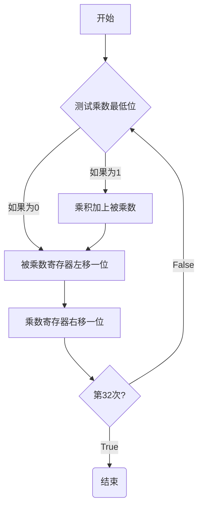
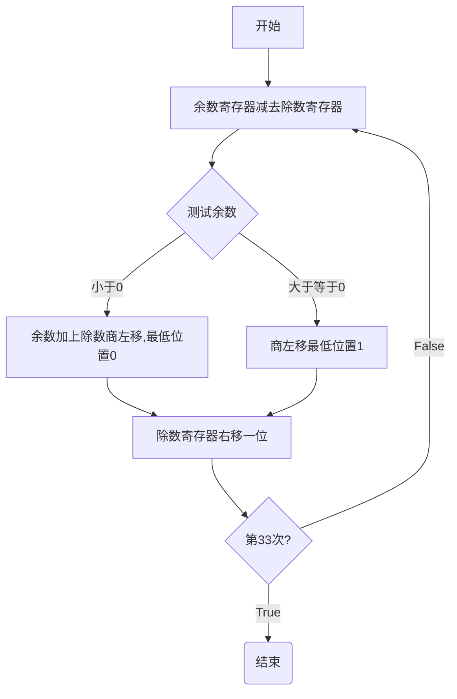

# ALU
### **ALU概述**

- ALU的实现

    操作数A,B 功能码funct 结果result 0位标志zero 溢出标志ovf

---

### **加法器**

- 一位
    S=A `xor` B `xor` C<sub>in</sub>
    C<sub>out</sub>=(A `and` B) `or` (A `and` C<sub>in</sub>) `or` (B `and` C<sub>in</sub>)
- 32位全加器
    使用32个一位全加器串行将低位的C<sub>out</sub>连接到相邻高位的C<sub>in</sub>
- 串行加法器
  - 逻辑简单
  - 速度慢
  - 性能 n*cp

- 超前进位

    C<sub>out</sub>=(A `and` B) `or` (A `and` C<sub>in</sub>) `or` (B `and` C<sub>in</sub>)
    =AB+(A+B)C<sub>in</sub>

    可以设进位生成因子g<sub>i</sub>=A<sub>i</sub>B<sub>i</sub>
    进位传递因子p<sub>i</sub>=A<sub>i</sub>+B<sub>i</sub>

    则C<sub>i+1</sub>=g<sub>i</sub>+p<sub>i</sub>C<sub>i</sub>

- 减法器

    `X`-`Y`=`X`+`(-Y)`=`X`+`~Y+1`

- 溢出
    V=C<sub>out</sub>`xor`C<sub>i-1</sub>

- 实现slt(小于则置位)

    进行减法 如果结果为负数则将最高有效位置1 result置1

    将最高有效位连接到最低的less输入

---

### **乘法器**



---

### **除法器**



---

### **乘法除法指令**

- `mult`乘法指令
- `multu`无符号乘法
- 编译器会使用位移代替乘数为2的幂次方的乘法操作
- `div`除法指令
- `divu`无符号除法
- `$HI`64位乘积高32位/除法的余数寄存器
- `$LO`低32位/除法的商
- `$HI`和`$LO`不能直接寻址访问需要通过`mflo`和`mfhi`指令进行操作
  
---

### **位移**

<font color=red><b>位移数大小为5位(2<sup>5</sup>=32)</b></font>

```asm
    sll $t2,$s0,8 #$t2=$s0<<8 (左移)
    srl $t2,$s0,8 #$t2=$s0>>8(逻辑左移)
    sra $t2,$s0,8 #$t2=$s0>>8(算术左移)
```

---

### **浮点数**

1.xxxx<sub>2</sub> * 2<sup>yyyy</sup>

格式
|S|指数|尾数|
|-|-|-|

x=(-1)<sup>S</sup> * (1+尾数) * 2<sup>指数-bias</sup>

规格化计数
`1.0<abs(1+尾数)<2.0`

储存的指数=实际的指数+bias

对于`float`:`bias=127`
对于`double`:`bias=1023`

|单精度指数|单精度尾数|双精度指数|双精度尾数|表示对象|
|-|-|-|-|-|
|0|0|0|0|0|
|0|非0|0|非0|+/-非规格化数|
|1~254|any|1~2046|any|+/-浮点数|
|255|0|2047|0|+/-无穷|
|255|非0|255|非0|NaN|

浮点数寄存器
    `$f0`~`$f31`
浮点数Load/Store
    `lwcl` `swcl`
单精度浮点数指令
    `add.s` `sub.s` `mul.s` `div.s` `c.x.s`
双精度
    `add.d` `sub.d` `mul.d` `div.d` `c.x.d`
浮点比较为真跳转
    `bclt` 
浮点比较为假跳转
    `bclf`