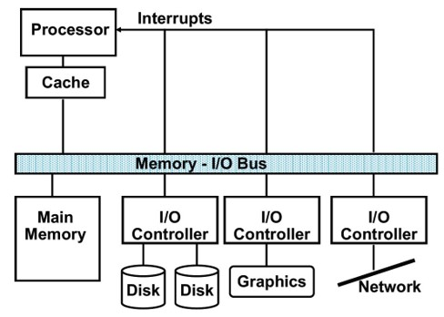
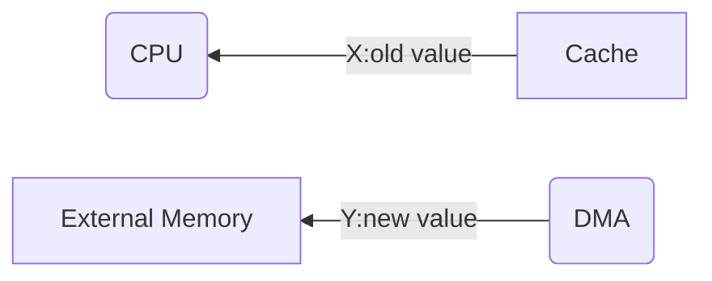

# IO

### **典型I/O系统**

- 完成内部二进制信息与外部多种信息间的交流
- 保证CPU正确选择输入输出设备并实现控制、传输数据、避免数据出错
- 利用数据缓存、选择合适的数据传送方式等，实现主机与外设间速度的匹配

---

### **I/O通信**

操作系统(OS)充当了I/O硬件和请求I/O的程序之间的接口
处理器检测I/O设备:端口映射I/O(PMIO) 内存映射I/O(MMIO)
I/O设备与处理器通信:轮询、中断驱动的I/O
中断驱动的I/O:
- 异步
- 不妨碍任何指令的完成
- 需要一种方法来识别产生中断的设备
- 可以有不同的紧急事务，需要一种机制来优先处理
- 当I/O数据从用户内存空间传输或传到用户内存空间时
- 需要特殊的硬件支持

---

### **异常处理寄存器**

- MIPS使用两个协处理器: C0和C1提供附加帮助
- C0主要帮助异常处理
- C1帮助浮点运算
- 每个协处理器都有几个寄存器

|寄存器号|寄存器名称|作用|
|-|-|-|
|8|BadVAddr|异常发生的内存地址|
|12|Status|异常发生时的中断屏蔽、使能位和状态|
|13|Cause|异常类型以及推迟中断位|
|14|EPC|引发异常的指令地址|

---

### **DMA(Direct Memory Access)**
- 对于高带宽设备(如磁盘)，中断驱动IO将消耗大量处理器周期
- 通过DMA DMA控制器能够直接将数据块传输到内存或者从内存中读取，而不需要经过处理器
- 处理器通过提供IO设备地址、要执行的操作、目的/源内存地址、要传输的字节数来启动DMA传输
- DMA控制器管理整个传输(长度可能为数千字节)，为总线进行仲裁
- 当DMA传输完成后，DMA控制器中断CPU，让CPU知道传输已经完成
- 一个系统中可能有多个DMA设备
- 处理器和DMA控制器争夺总线周期和内存

---

### **一致性问题(coherency Problem)**

DMA将一个新值Y存到Memory中
但CPU从Cache中得到的是旧值X

**一致性问题解决方案**
- 将所有IO活动路由到缓存中，但代价昂贵，对性能也有很大的负面影响
- 操作系统将IO输入涉及到的缓存条目设置为无效
- 强制写回IO输出涉及到的缓存条码，称为缓存刷新(flush)
- 增加硬件来有选择地无效缓存项:需要一个监视缓存控制器