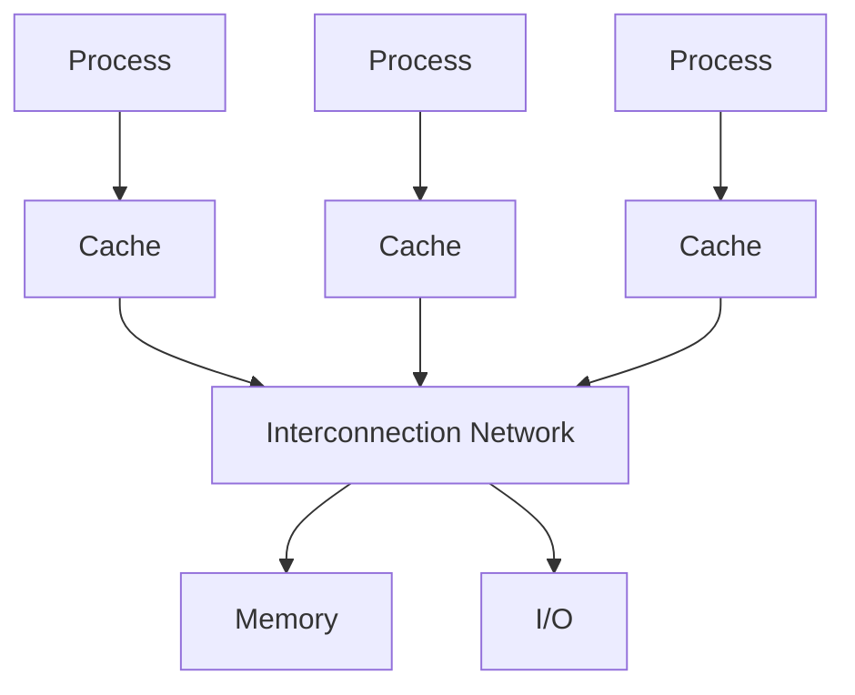
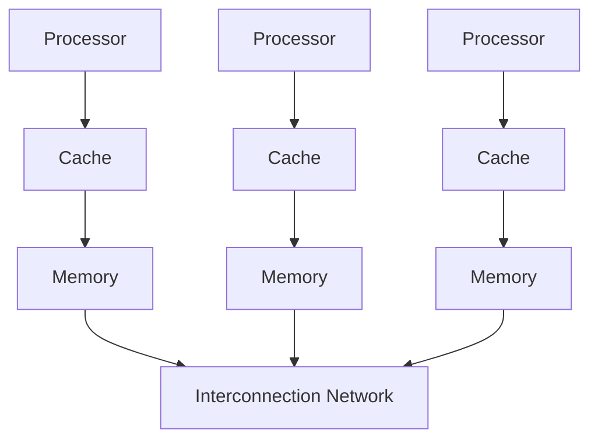

# 并行

---

- ### [目录](index.MD)
    
---

### **Amdahl定律**

```
    加速比S=1/(1-a+a/n)
    - a:可并行计算部分的占比
    - n:并行处理节点个数
```

设加速之前的执行时间为T<sub>o</sub>
可并行部分时间占比为a
则加速之后的执行时间T<sub>p</sub>=T<sub>o</sub>*(1-a+a/n)

---

### **多线程**

- 继续进行指令级并行(ILP)变得越来越复杂和困难
- 需要探索另一种并行方法(线程级并行TLP)
  - 多道程序间的TLP
  - 多线程应用的TLP
- 多线程利用线程级并行提高单个处理器的效率

---

### **硬件多线程**

<font color=red>在线程阻塞时处理器可以切换到另一个线程的实现</font>

- 通过执行与造成阻塞的指令不相关的指令来隐藏阻塞开销的方法
- 处理器必须为每个线程复制独立的状态
  - 寄存器文件、PC、指令缓存等
- 缓存、TLBS、BHTS、BTB等可以共享
  - TLBS:页表缓存
  - BHTS:分支历史信息表
  - BTB:分支目的缓冲
- 存储器自身可以通过虚拟存储器机制实现共享
- 硬件必须支持高效的线程切换

**<font color=red>细粒度多线程</font>**
每条指令之后都进行线程切换

- 多线程能够直接交叉循环执行
- 处理器能够在每个时钟周期进行切换
- :smile: 可以同时隐藏由短阻塞和长阻塞引起的吞吐量损失
- :disappointed:降低了单个线程的执行速度

**<font color=red>粗粒度多线程</font>**
仅在高开销阻塞时进行线程切换 如最后一级缓存缺失

- :smile: 几乎不会降低单个线程的执行速度
- :disappointed: 隐藏吞吐量损失能力受限 特别是短阻塞
- :disappointed: 线程切换时必须清空流水线 并填充流水线
- 适合用来降低高开销阻塞带来的性能损失

---

### **同时多线程(SMT)**
硬件多线程的变种
使用多发射动态调度流水线处理器的资源来挖掘线程级并行 并保持指令级并行

- 多发射处理器中通常有单线程难以充分利用的多个并行功能单元
- 借助于寄存器重命名和动态调度 不需要考虑相关性 即可发射来自不同线程的多条指令
- 每个线程需要单独的重命名表(RUUs) 或者需要指明一个表项属于哪个线程
- Intel Pentium 4的SMT 称为超线程(hyperthreading) 支持两个线程

---

### **示例**

- Coarse MT 粗粒度多线程
- Fine MT 细粒度多线程
- SMT 同时多线程

")

---

### **多核处理器**
至少两个处理器的计算机系统


- 通过任务级并行 或者进程级并行实现高吞吐量
- 将单个程序运行在多个处理器上实现性能的提升 并行处理程序

---

### **共享内存多核处理器(SMP)**

1. **如何共享数据**
  多个处理器同时共享一个物理地址空间
2. **如何合作处理任务**
   处理器通过存储器中的共享变量进行通信

<font color=red>通过同步机制访问共享数据，最多一个处理器进行访问</font>

**两种类型**

- 统一存储访问(Uniform Memory Access UMA)
- 非统一存储访问(Non-uniform Memory Access NUMA)

---

### **消息传递多核处理器(MPP)**

1. **如何共享数据**
  多个处理器通过相互传递消息实现数据共享
2. **如何合作处理任务**
  通过消息传递(send和receive)实现处理器间合作


