# 流水线

### **MIPS流水线**

五个阶段，每个阶段一个步骤

- 1. 取指令(IF)
    从指令存储器中取指令
- 2. 译码(ID)
    译码并读寄存器堆
- 3. 执行(EX)
    执行运算或计算地址
- 4. 访存(MEM)
    访问存储器
- 5. 写回(WB)
    将结果写回寄存器堆

<table><tr><td bgcolor=aqua>最长的执行阶段决定时钟周期时间</td></tr></table>

---

### **正确的流水线数据通路**

指令的信息随着指令的执行在流水线寄存器中保存

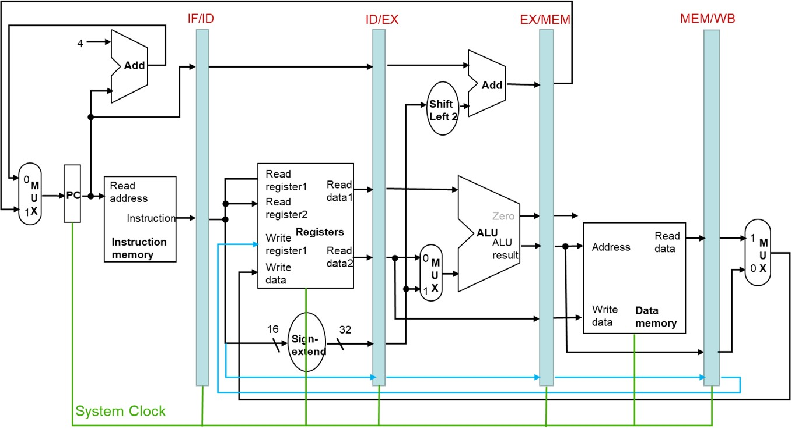

---

### **流水线控制**

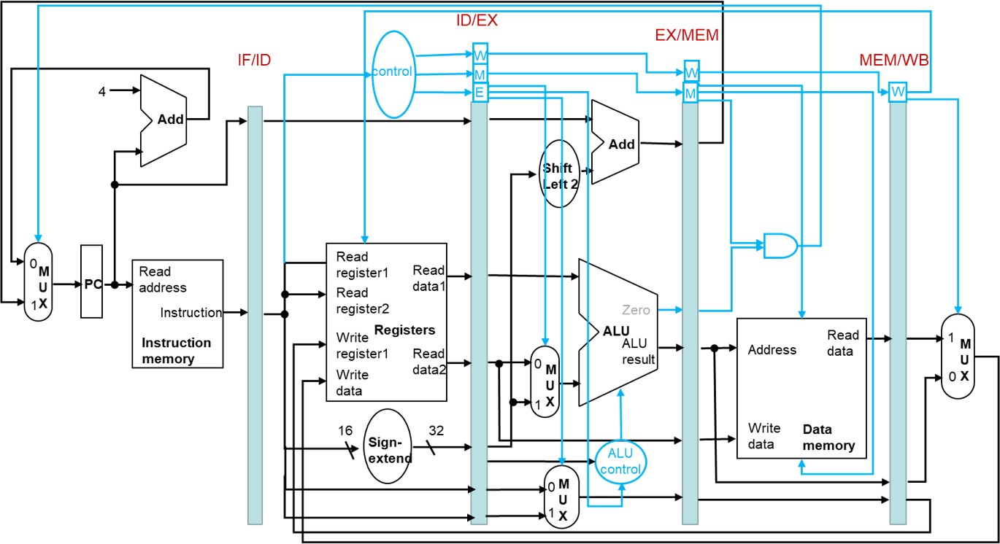

---

### **流水线冒险**

<table><td bgcolor=yellow>现流水线在下一个时钟周期不能执行下一条指令的情况</td></table>

- 结构冒险(Structural Hazard)
    缺乏硬件导致的冒险
    1. MIPS流水线中的存储器使用冲突
        - 取指令需要访问寄存器 
        - 数据传输指令lw和sw需要访问存储器
    2. 寄存器的访问冲突
        - 在同一个时钟周期内需要写和读寄存器
- 数据冒险(Data Hazard)
    无法提供指令执行所需要的数据，即需要等待前面的某些指令执行完数据的读写
    1. 寄存器导致的数据冒险
        - 一条指令的操作数来自于前面的某条指令
        ```asm
            add $s0,$t0,$t1
            sub $t2,$s0,$t3 #第二条指令需要的s0寄存器需要等待前面的指令写回
        ```
    2. 取数-使用型数据冒险
        - 在数据需要使用时，数据还没有从存储器读出
        ```asm
            lw  $s0,20($t1)
            sub $t2,$s0,$t3 #第二条指令需要的s0寄存器需要等待lw指令从存储器中取出数据
        ```
- 控制冒险(Control Hazard)
    - 分支冒险，指令执行不是顺序的，即下一条指令的地址依赖于正在执行的指令
        - 无条件分支(j,jal,jr)
        - 条件分支(beq,bne)
        - 异常
    - 解决方案
        - 阻塞
        - 提前产生分支结果
        - 延迟分支决策
        - 分支预测
---

### **解决结构冒险**

- 对指令和数据采用分开的L1缓存
    - Icache和Dcache
    
    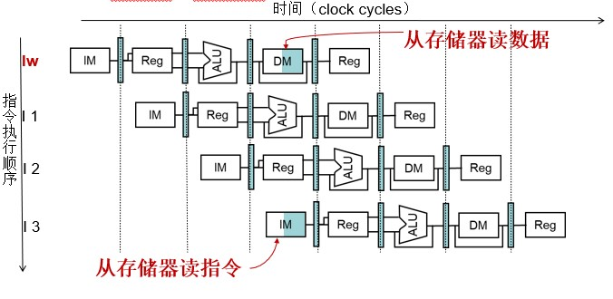

- 时钟的前半部分进行写，后半部分进行读
    - 上升沿触发寄存器读 下降沿触发寄存器写

    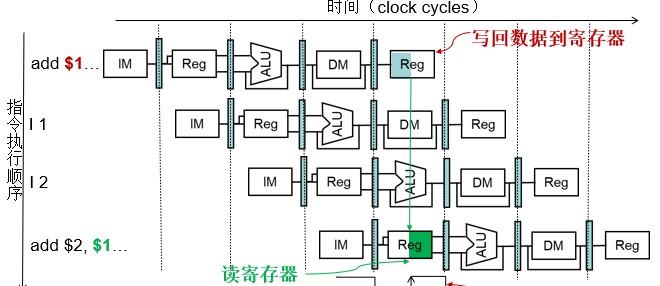

---

### **检测数据冒险**

- 设`[流水线阶段].Reg[Rs/Rd/Rt]`表示某流水线阶段需要的源/目的寄存器

- 当满足下列条件时会出现数据冒险

    - `EX/MEM.RegRd=ID/EX.RegRs`
    - `EX/MEM.RegRd=ID/EX.RegRt`
    - `MEM/WB.RegRd=ID/EX.RegRs`
    - `MEM/WB.RegRd=ID/EX.RegRt`

- 只有需要写回寄存器的指令才需要旁路
    即在MEM或WB阶段需要写入寄存器
- 目的寄存器不能是$0
    - `EX/MEM.RegRd!=0`
    - `MEM/WB.RegRd!=0`

例如
```asm
    add $s0,$t0,$t1
    sub $t2,$s0,$t3
```
第一条指令的`MEM.RegRd`=第二条指令的`ID.RegRs`所以会发生数据冒险


### **解决数据冒险**

- 旁路

    **<font color=red>前推</font>**
    在EX级产生结果之后立马发送给下一条指令

    - 建立额外的数据通路连接ALU的输出到输入
    - 不需要等待结果写回到寄存器

    例如
    ```asm
        add $s0,$t0,$t1
        sub $t2,$s0,$t3
    ```
    可以建立一条额外的数据通路 直接将第一条的ALU输出结果连接到第二条的ALU输入就不用再等待上一条指令的访存和写回阶段


- 旁路的数据通路
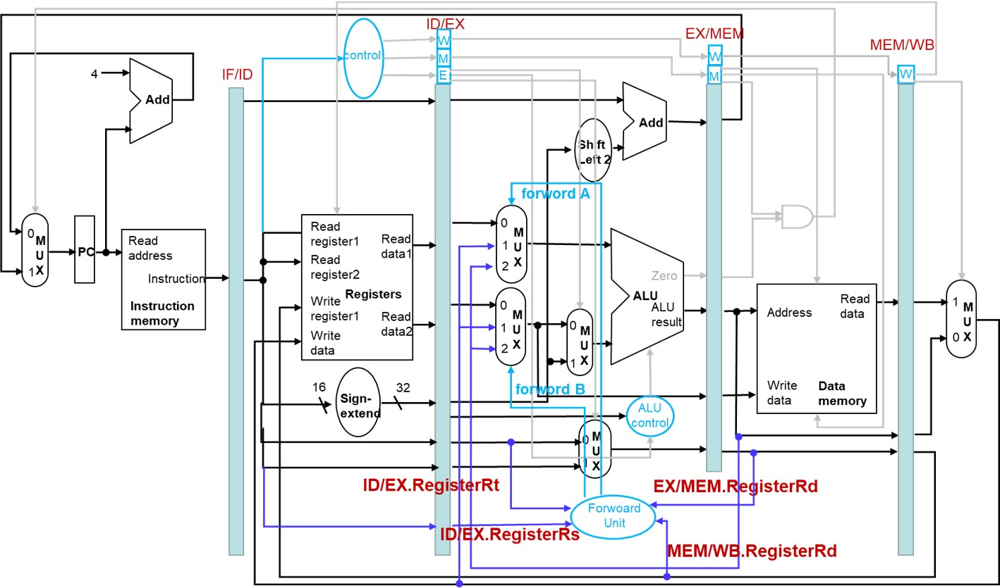

- 旁路多选器的控制信号

|Mux control|Source|Explanation|
|:-:|:-:|:-:|
|`ForwardA=00`|ID/EX|第一个ALU来自寄存器堆|
|`ForwardA=10`|EX/MEM|第一个ALU操作数由上一个ALU运算结果旁路获得|
|`ForwardA=01`|MEM/WB|第一个ALU操作数从数据存储器或者往前数第二条指令的ALU结果中旁路获得|
|`ForwardB=00`|ID/EX|第二个ALU操作数来自寄存器堆|
|`ForwardB=10`|EX/MEM|第二个ALU操作数由上一个ALU运算结果旁路获得|
|`ForwardB=01`|MEM/WB|第二个ALU操作数由数据存储器或者往前数第二条指令的ALU结果旁路获得|

- 生成旁路信号
    - EX冒险
    `if(EX/MEM.RegWrite and (EX/MEM.RegRd!=0) and (EX/MEM.RegRd=ID/EX.RegRs))ForwardA=10`
    `if(EX/MEM.RegWrite and (EX/MEM.RegRd!=0) and (EX/MEM.RegRd=ID/EX.RegRt))ForwardB=10`
    - MEM冒险
    `if(MEM/WB.RegWrite and (MEM/WB.RegRd!=0) and (MEM/WB.RegRd=ID/EX.RegRs))ForwardA=01`
    `if(MEM/WB.RegWrite and (MEM/WB.RegRd!=0) and (MEM/WB.RegRd=ID/EX.RegRt))ForwardB=01`
- 这种生成的旁路信号无法解决潜在数据冒险

```asm
    add $1,$1,$2
    add $1,$1,$3
    add $1,$1,$4
    #在这种情况下对于二三条指令EX/MEM.RegRd=ID/EX.RegRs会发生MEM冒险
    #对于第一三条指令有MEM/WB.RegRd=ID/EX.RegRs
    #所以会同时发生EX级和MEM级的数据冒险
    #而EX级的数据是更新的(即第二条指令的结果)
    #所以只需要使用第二第三条指令之间的EX旁路
``` 
- 所以我们要修改旁路信号生成条件(生成MEM级旁路信号时判断是否有EX级信号)

    - `if(MEM/WB.RegWrite and (MEM/WB.RegRd!=0) and (MEM/WB.RegRd=ID/EX.RegRs) and ForwardA!=10)ForwardA=01`
    - `if(MEM/WB.RegWrite and (MEM/WB.RegRd!=0) and (MEM/WB.RegRd=ID/EX.RegRt) and ForwardB!=10)ForwardB=01`

- 阻塞方式解决数据冒险
    ```
        lw  $s0,20($t1)
        sub $t2,$s0,$t3
    ```
    -  对于第二种数据冒险(取数-使用型)无法使用旁路来解决
    - 因为数据只有在MEM阶段后才能获得
    - 可以阻塞掉一个时钟周期，再通过旁路就能从MEM阶段将数据传输到下一个指令的EX阶段
    - 插入空指令nop阻塞掉一个时钟周期
    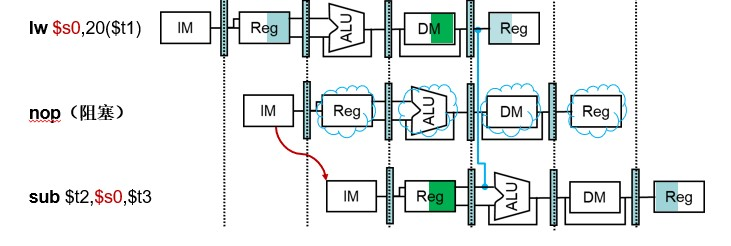

- 第二种数据冒险要在译码(ID)阶段检测
`if(ID/EX.MemRead and ((ID/EX.RegRd=IF/ID.RegRd) or (ID/EX.RegRd=IF/ID.RegRt)))`

- 如果有取数-使用型冒险，则阻塞流水线一个时钟周期

- 实现nop指令
    - EX MEM WB阶段不进行操作
    - 阻止PC和IF/ID寄存器更新
    - 重复译码当前指令
    - 重复提取下一条指令
  
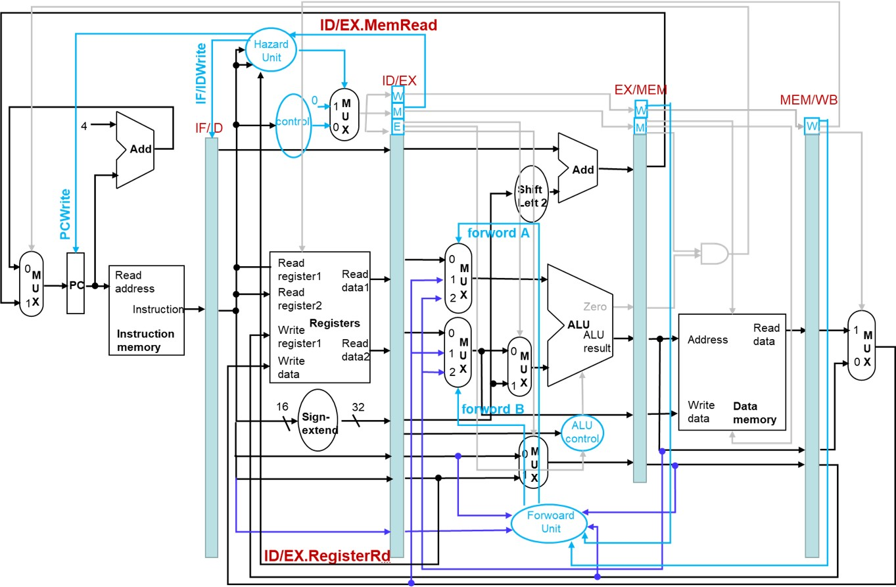

- 通过编译器优化来避免取数-使用型数据冒险
    - 例如
    ```C
        A=B+E;
        C=B+F;
    ```
    ```asm
        lw $t1,0($t0)
        lw  $t2,4($t0)
        add $t3,$t1,$t2
        sw  $t3,12($t0)
        lw  $t4,8($t0)
        add $t5,$t1,$t4
        sw  $t5,16($t0)
        #第二三条指令会发生冒险
        #第五六条指令会发生冒险
    ```
    ```asm
        #可以将三条lw指令都提前(即先取数)来解决冒险
        lw $t1,0($t0)
        lw  $t2,4($t0)
        lw  $t4,8($t0)
        add $t3,$t1,$t2
        sw  $t3,12($t0)
        add $t5,$t1,$t4
        sw  $t5,16($t0)
    ```

- 解决控制冒险:无条件跳转
    - 首先假定分支不会发生(正常PC+4)
    - 在跳转指令完成ID阶段得到跳转地址后清除流水线
    - `IF.Flush`清空流水线指令(即去掉PC+4)
    - 跳转指令设置PC,将分支目标地址加入到流水线寄存器
  
    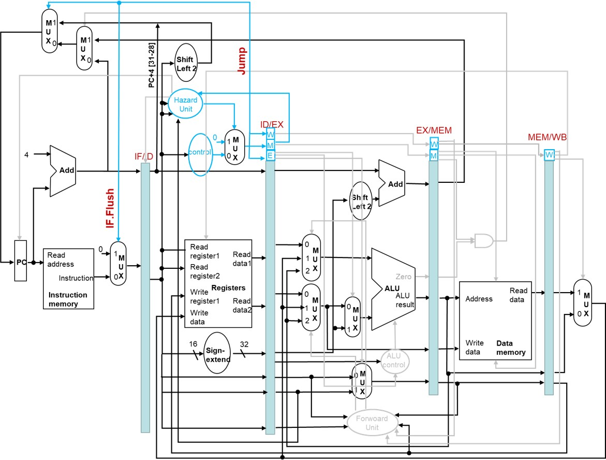
- 解决控制冒险: 提前计算分支结果
    - 将生成分支结果的硬件放在ID级
    - 如果有分支 按照无条件跳转处理
    - 提前算分支可能会发生数据冒险,这时候需要阻塞流水线
        - 普通的寄存器冒险:阻塞一次
        - 取数-使用型:阻塞两次
    - 分支旁路
        - EX冒险
            `if(IDcontrol.Branch and(EX/MEM.RegRd!=0) and (EX/MEM.RegRd==IF/ID.RegRs)ForwardC=10`
            `if(IDcontrol.Branch and(EX/MEM.RegRd!=0) and (EX/MEM.RegRd==IF/ID.RegRt)ForwardD=10`
        - MEM冒险
            `if(IDcontrol.Branch and(MEM/WB.RegRd!=0) and (MEM/WB.RegRd==IF/ID.RegRs)ForwardC=01`
            `if(IDcontrol.Branch and(MEM/WB.RegRd!=0) and (MEM/WB.RegRd==IF/ID.RegRt)ForwardD=01`   

        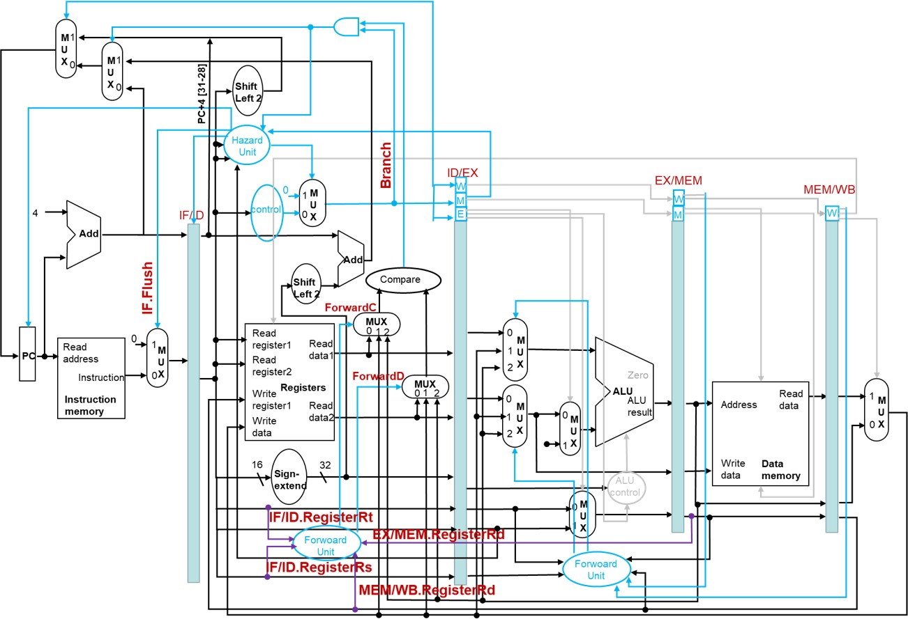
- 解决控制冒险:延迟分支
    <table><td bgcolor=yellow>MIPS编译器将一条指令移到分支指令之后可以延迟分支目的指令的执行从而隐藏分支延迟</td></table>
    
    ```
    A从前面调度
        add $1,$2,$3
        <分支指令>
        [delay]
        #把分支前面的指令移动到[delay],即把原来的分支计算延迟拿来执行add指令
        #即修改为
        <分支指令>
        add $1,$2,$3
    ```
    ```
    B从目标处调度
        sub $4,$5,$6    #分支目标
        add $1,$2,$3
        <分支指令>
        [delay]
        #用目标处替换delay
        #分支发生概率大时采用此方案最佳
        #修改为
        add $1,$2,$3
        <分支指令>
        sub $4,$5,$6
    ```
    ```
    C 从不发生处调度
        add $1,$2,$3
        <分支指令>
        [delay]
        sub $4,$5,$6    #如果分支发生则不执行该指令
        #用sub替换delay
        #如果分支不发生，可以提高sub的执行效率
        #修改为
        add $1,$2,$3
        <分支指令>
        sub $4,$5,$6
    ```
- 解决控制冒险:动态分支预测

    - 分支预测缓存
    - 分支指令地址低位索引
    - 存储分支结果
    - 查表，如果预测的结果与上一次结果一样
    - 按照预测结果取指令
    - 如果错误，清空流水线，重新执行
    - 取反预测结果
    - 1位预测
        每次错误都取反预测结果
    - 2位预测
        错误两次再取反
    - 结合分支预测器，计算分支目标地址
        - 缓存目标地址
        - 如果预测正确，且分支指令发生，则直接从缓存中提取目标地址
- 解决控制冒险-异常

|异常|流水级|是否同步|
|---|---|---|
|算数溢出|EX|是|
|未定义指令|ID|是|
|TLB或页缺失|IF MEM|是|
|I/O请求|全部|否|
|硬件故障|全部|否|
与处理分支预测错误类似
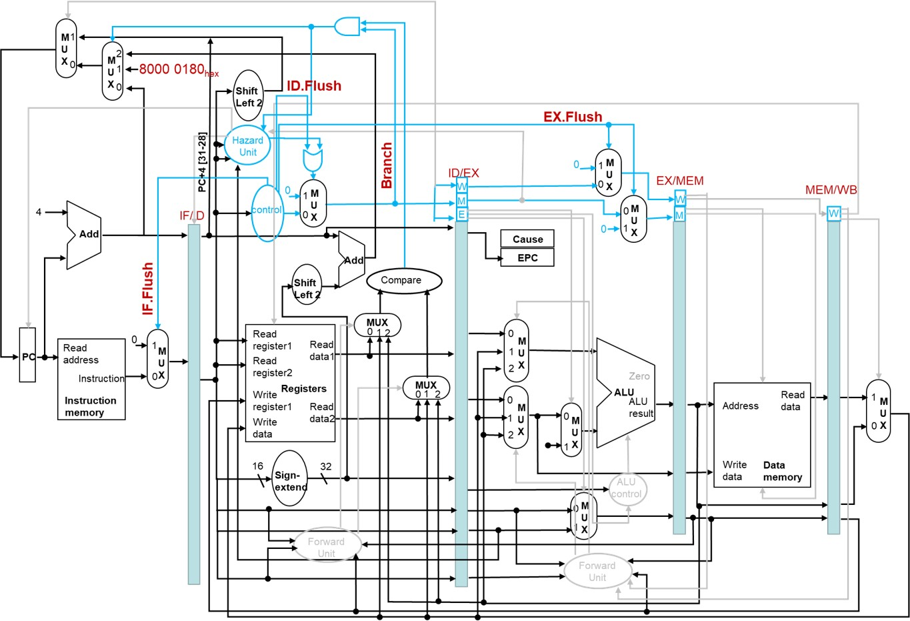
    

### **依赖**

- 结构冒险——资源冲突
- 数据冒险——数据依赖
- 控制冒险——过程依赖

### **数据冒险**

- RAW
    写后读(真相关)
    当前指令使用的时前面指令更新的数据，必须保持执行顺序
- WAR
    读后写(反相关)
    当前指令需要更新数据，前面指令使用的时原来的数据，必须保持指令的执行顺序
- WAW
    写后写(输出相关)
    两条指令会相继更新数据，必须保持指令执行顺序
- 解决存储冲突
<table><td bgcolor=yellow>处理器重命名指令中的寄存器标识符</td></table>

- 硬件通过空闲寄存器池中分配一个寄存器进行重命名
- 数据使用之后将寄存器释放回去

```C
    R3=R3*R5;
    R4=R3+1;
    R3=R5+1;
    //修改为
    R3b=R3a*R5a;
    R4a=R3b+1;
    R3c=R5a+1;
```

---

### **静态多发射**

- 编译器封装多条指令处理冒险
  - 将可以在同一时钟周期执行的指令封装成发射包
  - 由流水线的资源数量所决定
- 一条执行多个操作的长指令
  - 指定多个并发操作
  - 超长指令字(VLIW)
- 编译器处理数据冒险和控制冒险
  - 调度代码、封装发射包
  - 发射包内指令间不能存在依赖
  - 发射包间可以存在指令间依赖
  - 如果需要可以封装nop操作
- 相关技术
  - 双发射中的冒险
    - EX级发射数据冒险
    - 取数使用型数据冒险
  - 需要编译技术
    - 指令调度
    - 循环展开

---

### **动态多发射**

<table><tr><th>超标量(Superscalar)</th></tr><tr><td bgcolor=yellow>硬件在运行时动态决定那些指令同时发射和执行</td></tr></table>

- 超标量处理器运行机制
  - 取指令和发射：取指令、译码并发射到功能单元，等待执行
  - 指令执行：一旦所需要的功能单元、源操作数就绪，就可以执行指令
  - 提交：当可以写回数据时进行写回
- 按序&乱序
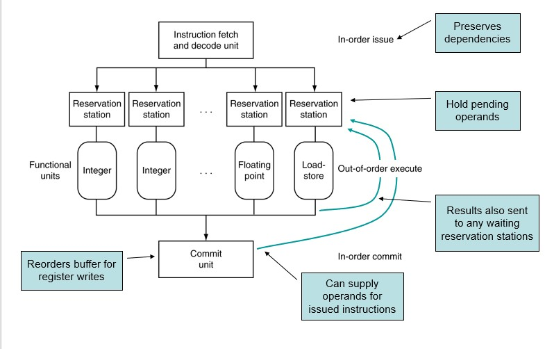