# 存储器

---

- ### [目录](index.MD)
    
---

### **存储系统**

- 存储器的容量由寻址策略决定

|例如|
|:-:|
|采用16位地址，寻址空间为216=65536存储单元||

- 大多数存储器是字节可寻址(byte-addressable)
- 每个存储单元的大小为1字节
- 大多数计算机是以字为单位(word)检索或存储数据
- 常用缩写
    - 1K=210(Kilo)
    - 1M=220(Mega)
    - 1G=230(Giga)
    - 1T=240(Tera)

---

### **存储体系结构**

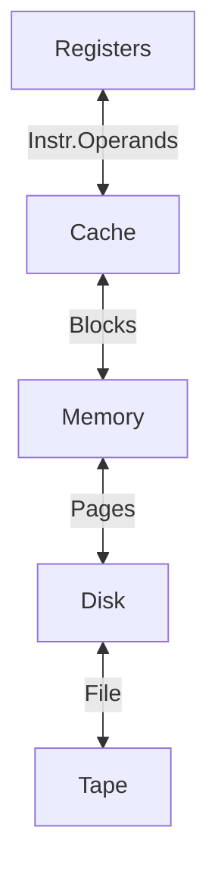
---

### **局部性原理**
程序局部性的访问地址空间

- 时间局部性
    如果某个数据项被访问，那么在不久的将来他可能再次被访问
    - 例如，loop循环中的指令
- 空间局部性
    如果某个数据项被询问，与它地址相邻的数据项可能很快也将被询问
    - 例如，顺序的指令执行，数组数据等

---

### **静态随机存储器(SRAM)**

- 存储1bit数据需要6个晶体管
- 大多数芯片使用SRAM
- 一对弱交叉耦合反相器
- 数据存储在交叉耦合反相器

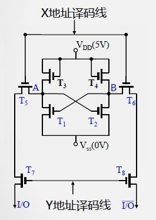

- X地址译码线
- Y地址译码线
- T1、T2保存数据
- T3、T4补充电荷
- T5、T6、T7、T8起开关作用

**工作原理**
- X地址译码线(行选通)
    - T5、T6导通
    - A点与位线(Bit line)相连
- Y地址译码线(列选通)
    - T7、T8导通
    - A点输出到I/O端

---

### **1-T DRAM存储单元**

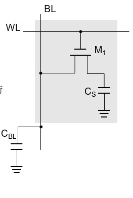

- 1个晶体管和一个存储电容存储数据，有电荷为1，否则是0

**写数据**
- 写0
    BL=0V，WL=5V，M1通，Cs电荷减少为0，表示0
- 写1
    BL=5V，WL=5V，M1通
    Cs电荷增加，表示1

**读数据**
- 读0
    BL=2.5V，WL=5V，M1通，感应BL线电势降低，低于2.5V，识别为0
- 读1
    BL=2.5V，WL=5V，M1通，感应BL线电势升高，高于2.5V，识别为1

**保存数据**

- WL=0V，M1断，电荷保存在电容Cs中

---

### **存储控制器**

- 控制处理器与存储器间的交互
- DRAM需要频繁刷新，并且采用时分复用信号减少引脚数
- SRAM管理简单，通常不需要存储控制器

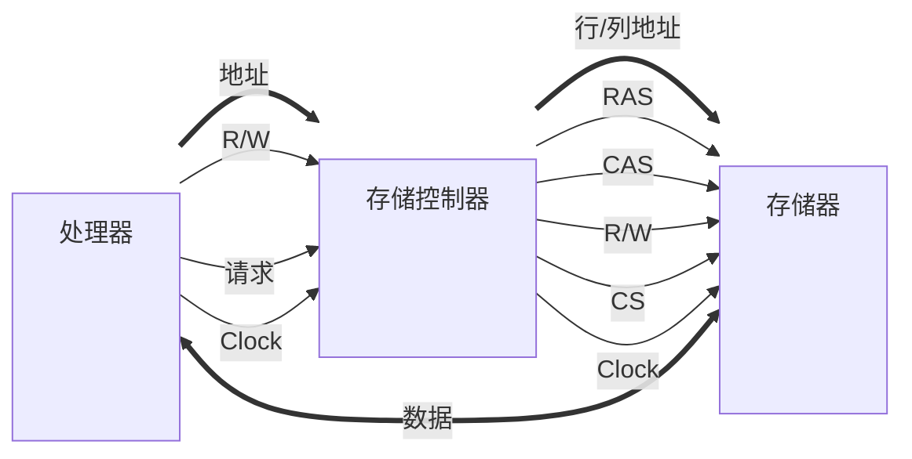
### **存储模块交叉存取**

- 两个或多个兼容的存储模块
- 在一个存储模块中，采用多个并行访问的片

|例如|
|:-:|
|八个存储模块，每个模块有八个片，实现8*8 bit的存储器总线|

- 交叉存储可以在类似于双通道内存架构中实现

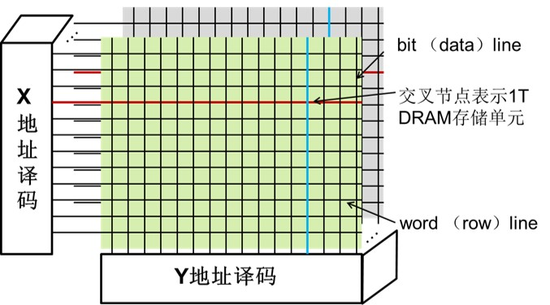

---

### **缓存-内存映射**

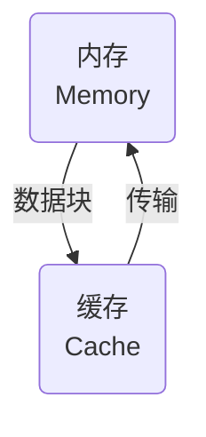
- 内存单元到缓存行间的对应关系
- 缓存行(Cache line)=缓存块(Cache block)
- 设计点
    - 可以快速判断缓存命中或缺失
    - 充分利用容量有限的缓存，提高命中率

**硬件设计中需要解决的问题**

1. 如何判断数据是否在缓存中
2. 如果在缓存中，如何找到该数据

---

### **直接映射(Direct Mapping)**

以16位内存地址为例

|标签(tag)|块号(#block)|字节偏移(offset)|
|:-:|:-:|:-:|
|5bits|7bits|4bits|

- 每个缓存块有24</suo>=16bytes
- 27=128缓存块
- 2(7+5)=4096个内存块

- 缓存块号=(内存块地址)`mod`(缓存中块总数)
    - 内存块j映射到(`j mod 128`)缓存块
- 如果标签相同则缓存命中

---

### **MIPS中的直接映射缓存**

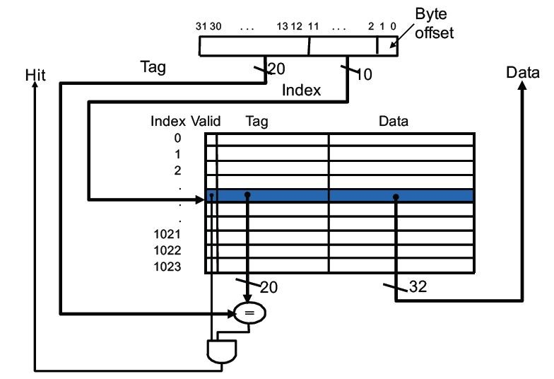

缓存块大小为1 word (4 bytes)

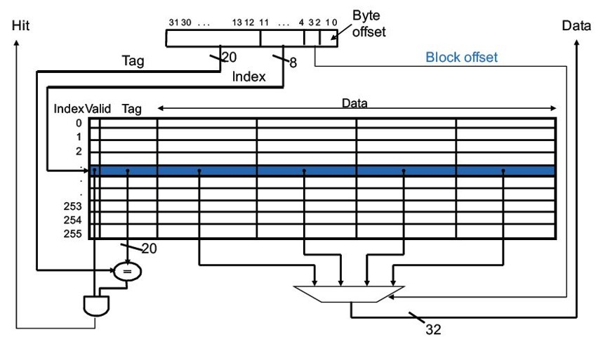

缓存块大小为4 word (16 bytes)

---

### **MIPS缓存设计**

**缓存需要存储数据以及其对应的标签**

- 2n个块的直接映射缓存，n个bit用于索引
- 大小为2m个字(2m+2个字节)的缓存块，m个bit用于寻址块中的字
- 2bit用于寻址一个字中的字节

|标签字段的大小|直接映射缓存中存储的总bit|
|:-:|:-:|
|32-(m+n+2)|2n X (块大小+标签字段大小+有效位大小)|

---

### **全相联映射**

以16位内存地址为例

|标签(tag)|字节偏移(offset)|
|:-:|:-:|
|12bits|4bits|

- 每个缓存块中有24=16 bytes
- 128个缓存块
- 212=4096个内存块
- 内存块可以映射到任意的缓存块
- 128个缓存块的标签需要与地址的标签位进行并行的比较(硬件实现)

---

### **组相联映射**

以16位内存地址为例

|标签(tag)|组号(set)|字节偏移(offset)|
|:-:|:-:|:-:|
|6bits|6bits|4bits|

- 每个缓存块中有24=16 bytes
- 128个缓存块分为26=64个组
- 212=4096个内存块

- 结合了直接映射和全相联映射的特点
- 缓存组号=(内存块地址)`mod`(缓存中组的总数)；内存块j映射到(`j mod 64`)缓存组
- 每组有K个块称为K路组相联

---

### **MIPS中的组相联映射缓存**

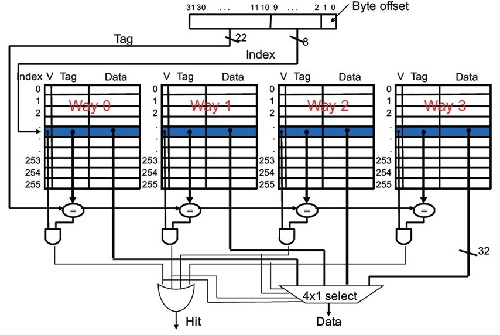

---

### **处理缓存写命中**

D cache

**策略1:写直达(Write-Through)**

- 保持缓存和内存数据的一致性
- 将数据同时写回到缓存和下层存储层级
- 加入写缓缓冲(write buffer)，只有写缓冲满时才停止写回缓存

**策略2:写回(Write-Back)**

- 只将数据写回到缓存
- 只有需要将缓存块驱逐(evicted)时，才写回到下层存储层级
- 每个缓存块需要1 bit 脏块(dirty) 标记

---

### **处理缓存写缺失**

**带写缓冲的写直达缓存**

- 没有写分配(No-write allocate):内存块更新后，不重新载入缓存
- 跳过缓存更新，但是需要将该缓存块置位无效
- 将写回数据写入写缓冲

**写回缓存**

- 写分配
- 更新缓存中的数据，包括标签和数据
- 不需要写命中检测

---

### **替换算法**

- 直接映射:不需要选择替换的块
- 组相联映射:
    - 首先映射到有效位为0的项
    - 如果没有，在该组的项中挑选一个项替换
- 最近最少使用(Least-recently used, LRU)
    - 替换很长时间没有使用的块
    - 不适用于超过4路的组相联映射
- 随机替换
    - 当相连度较高时，与LRU性能类似

---

### **虚拟存储器(Virtual Memory)**

- 将主存用作辅助存储器的高速缓存的技术
- 程序拥有自己的虚拟地址空间，存储频繁访问的代码和数据
- 根据局部性原理设计
- 优势
    - 运行时，CPU和OS将虚拟地址转化为物理地址
    - 实现多个程序共享存储器
    - 允许运行超过主存容量的程序
    - 代码重定位: 代码可以加载进内存的任何地方

---

### **虚拟存储器架构**

- 部分进程临时存放在硬盘，一旦需要运行就载入内存
- 载入由操作系统执行，应用程序不需要知道虚拟存储器的存在
- 存储管理单元(MMU)将虚拟地址转化为物理地址

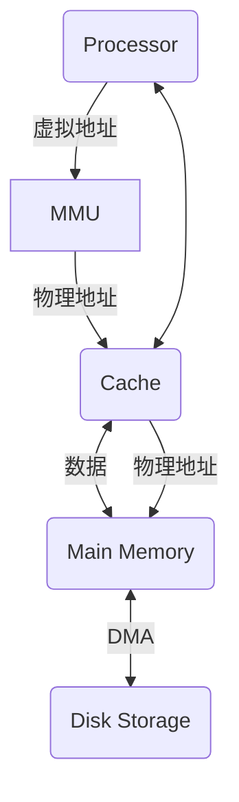

---

### **地址转换**

- 存储器的数据传输单元为页(page)
    - 页大小:4KB~16KB
    - 与缓存块大小设计类似
    - 页太小: 花费较长时间在磁盘寻址页
    - 页太大: 页中部分存储空间空闲
- 在磁盘中寻址数据需要花费较长时间，一旦找到数据，能以每秒几MB的速度进行数据传输
- 如果页太大，页中部分存储空间空闲，造成内存中很大一部分存储空间的浪费

- 虚拟地址到物理地址的转换由软硬件协同完成
- 存储访问请求需要先进行地址转换
- 处理器请求的虚拟地址:
    - 高位字段代表虚拟页号(virtual page number)
    - 低位字段代表页偏移(page offset)

---

### **页表映射**

- 页表(Page Table)
保存着虚拟地址和物理地址之间转换关系的表
    - 以虚拟页号为索引
    - 指向页表首地址的寄存器：页表寄存器(page table register)

- 页在内存中：页表中的对应项将包含虚页对应的物理页号和状态信息
- 页不在内存中：页表可以指向磁盘的交换区(swap space)中的地址

### **采用页表进行地址转换**
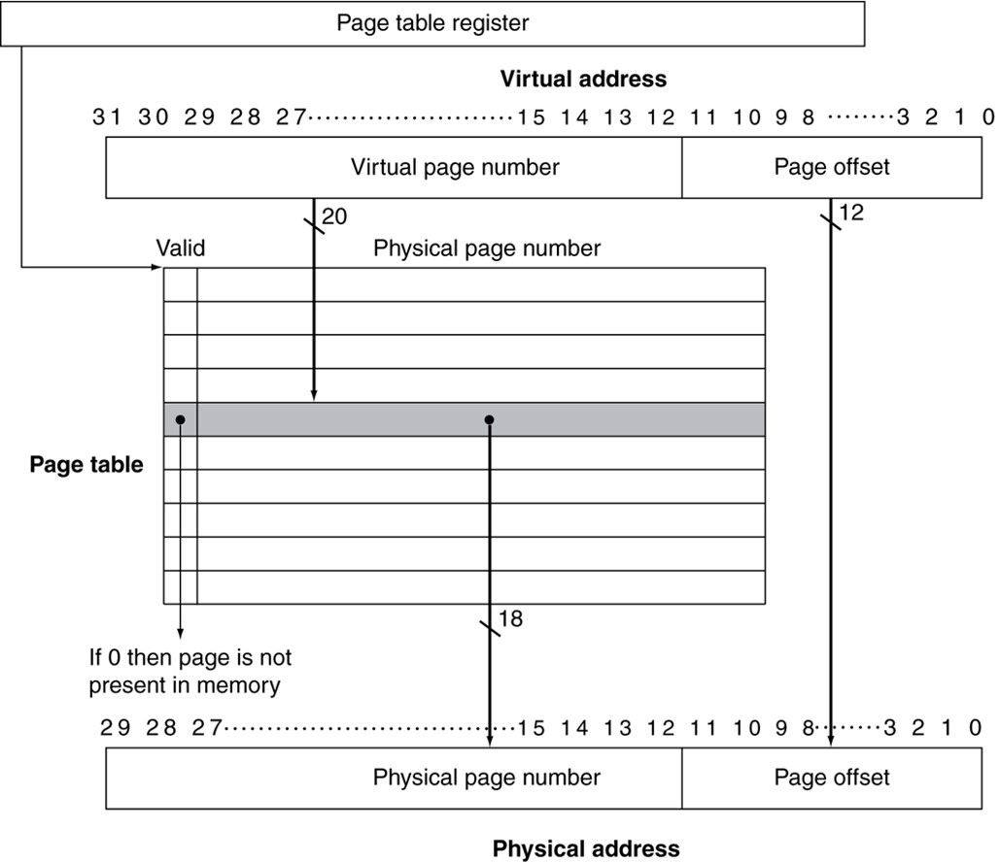

### **TLB**

- TLB是CPU中特殊的地址转换表(Translation Look-aside Buffer,TLB)
- 可以减少页表访问

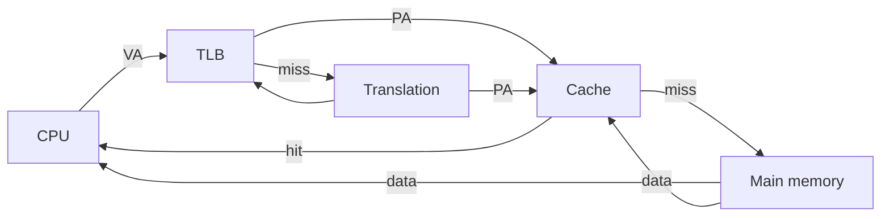

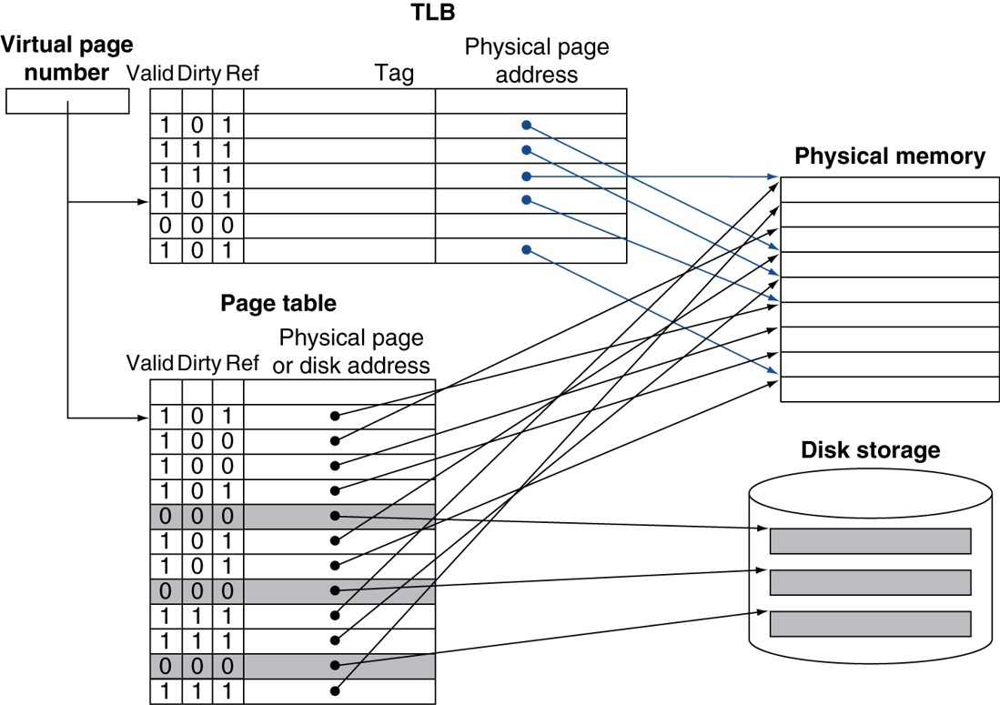

- 与cache设计类似，可以是全相联，组相联，直接映射
- 容量比cache小，访问速度比cache快
- 一般不超过512表项
- TLB缺失
    - 如果页在内存中，缺失可以处理
        - 从内存中提取PTE到TLB
        - 硬件处理
        - 特殊软件处理
    - 如果页不在内存中，发生缺页错误(page fault)

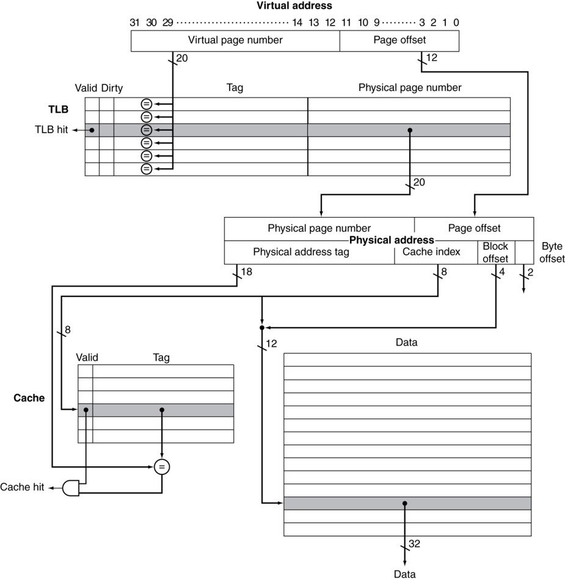
